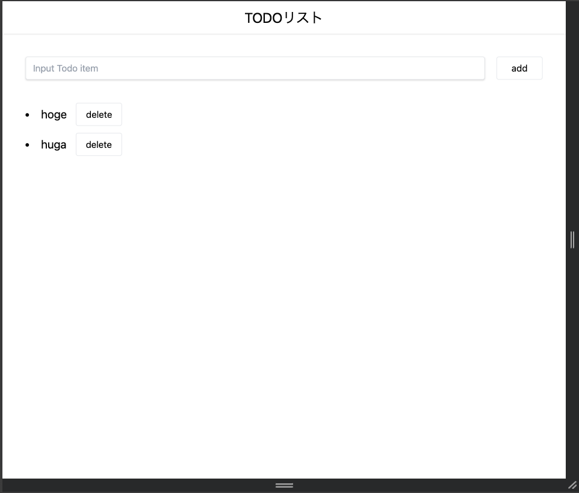
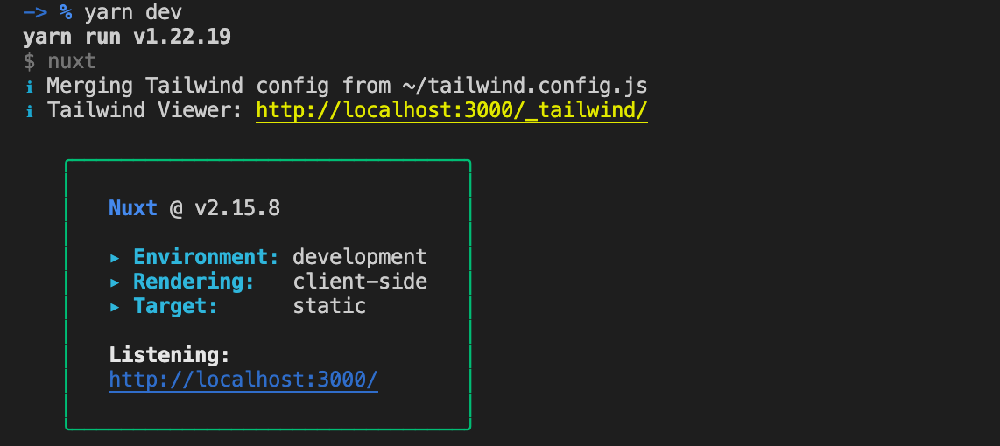

# TODO アプリ

## 概要

Nuxt.js と TypeScript を用いてで TODO アプリを実装する。



## 機能一覧

- ヘッダー
  - タイトルを中央寄せで表示
- 入力フォーム
  - タスクを入力
  - 追加ボタンをクリックでタスクをリストに追加
  - 追加後、入力値をクリア
- タスクリスト
  - 箇条書きでタスクを表示
  - タスクの右に削除ボタンを配置
  - 削除ボタンクリックでタスクを削除

## 補足

- ボタンはコンポーネント化してください
- データ管理は vuex を用いても、props による受け渡しでもどちらでも構いません
- vue ファイル内の変数等は型をつけてください。
- UI に関しては自由です
- コミットの粒度やコミットメッセージはチーム開発を意識したものにしてください。
- PC/スマートフォンの両方でデザインが崩れないようにしてください(検証ツールにて確認)
- 技術的な面でわからないものがあれば[こちら](https://github.com/TheDesignium/dezban-frontend-skill-check/wiki/%E5%8F%82%E8%80%83%E8%A8%98%E4%BA%8B)に目を通してみてください。

## 技術スタック

- フレームワーク: Nuxt.js 2 系
- 言語: TypeScript
- CSS フレームワーク: TailwindCSS

## 実行手順

### 1.環境構築をする

- [こちら](#環境構築)を参考に行ってください

### 2.作業ブランチを作成

branch 名は`intern/github名/年月/todo-list`としてください。

ex) `intern/mnt3710/202401/todo-list`

```bash
$ git checkout -b ブランチ名
```

### 3.作業着手

[機能一覧](#機能一覧)を参考に todo アプリを作成してください。

### 4.PR 作成

PullRequest を作成する際は以下の項目を確認してください。

- [ ] コンポーネントファイルやイメージファイルを参照するときは@ではなく~になっているか。
- [ ] `console.log()`がコード内に残っていないか。
- [ ] `yarn lintfix`を実行し、フォーマットが整っているか。
- [ ] PR に正常に動作していることが確認できる画像、または動画を入れているか。

## 環境構築

既にインストールされているものは飛ばしてください。

また、macOS の場合の環境構築のため、windows を使っている方は参考にして適宜調べてください。

### 1. vscode のインストール

[こちら](https://chigusa-web.com/blog/vs-code-install/)から vscode のインストールをする

### 2. リポジトリをローカルに持ってくる

github 上にあるスキルチェックのテンプレートを自分の pc に持ってくる。

```bash
$ git clone https://github.com/TheDesignium/dezban-frontend-skill-check.git

$ cd dezban-frontend-skill-check
```

### 3. nvm のインストール

```bash
$ curl -o- https://raw.githubusercontent.com/nvm-sh/nvm/v0.39.3/install.sh | bash
```

### 4. node のインストール

```bash
$ nvm install v16.14.1
```

正常にインストールされていたら以下のようにバージョンが表示される。

```bash
$ node --version
v16.19.0
$ npm --version
8.19.3
```

※ vscode 上のターミナルで作業していて、version が出てこない場合は vscode を再起動する

### 5. yarn のインストール

```bash
$ npm install -g yarn
$ yarn -v
```

### 6. localhost を立ち上げる

```bash
$ yarn
$ yarn dev
```



http://localhost:3000 を開く。

## vscode の推奨拡張機能

- Vetur
- ESlint
- Prettier - Code formatter
- Tailwind CSS IntelliSense

## 想定されるエラー

### nuxt not found

package.json を確認(github 上と同じであることを確認)

github と違う内容であれば`git pull origin main`を実行

再度`yarn`を実行

`yarn dev`を実行
