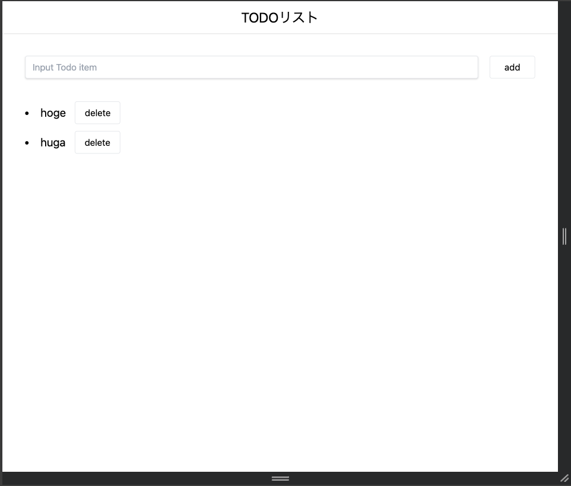

# TODOアプリ
## 概要
Nuxt.jsとTypeScriptを用いてでTODOアプリを実装する。



## 機能一覧
- ヘッダー
  - タイトルを中央寄せで表示
- 入力フォーム
  - タスクを入力
  - 追加ボタンをクリックでタスクをリストに追加
  - 追加後、入力値をクリア
- タスクリスト
  - 箇条書きでタスクを表示
  - タスクの右に削除ボタンを配置
  - 削除ボタンクリックでタスクを削除

## 補足
- ボタンはコンポーネント化してください
- データ管理はvuexを用いても、propsによる受け渡しでもどちらでも構いません
- vueファイル内の変数等は方をつけてください。
- UIに関しては自由です
- 技術的な面でわからないものがあれば[こちら](https://github.com/TheDesignium/dezban/wiki/%E3%83%81%E3%83%A5%E3%83%BC%E3%83%88%E3%83%AA%E3%82%A2%E3%83%AB)に目を通してみてください。


## 技術スタック
- フレームワーク: Nuxt.js 2系
- 言語: TypeScript
- CSSフレームワーク: TailwindCSS


## 実行手順
### 1.環境構築をする
- [こちら](#環境構築)から行ってください
### 2.作業ブランチを作成
branch名は`feature/github名/年月/todo-list`としてください。
```
# example
feature/mnt3710/202401/todo-list

# branchの作成方法
git checkout -b ブランチ名
```
### 3.作業着手
[機能一覧](#機能一覧)を参考にtodoアプリを作成してください。

### 4.PR作成
PRには動作が確認できるような動画を添付してください


## 環境構築
- vscodeのインストール
- nodeのインストール

https://github.com/TheDesignium/dezban/wiki/%E7%92%B0%E5%A2%83%E6%A7%8B%E7%AF%89

## vscodeの推奨拡張機能

こちらから追加することができます。
- Vetur
- ESlint
- Prettier - Code formatter
- Tailwind CSS IntelliSense